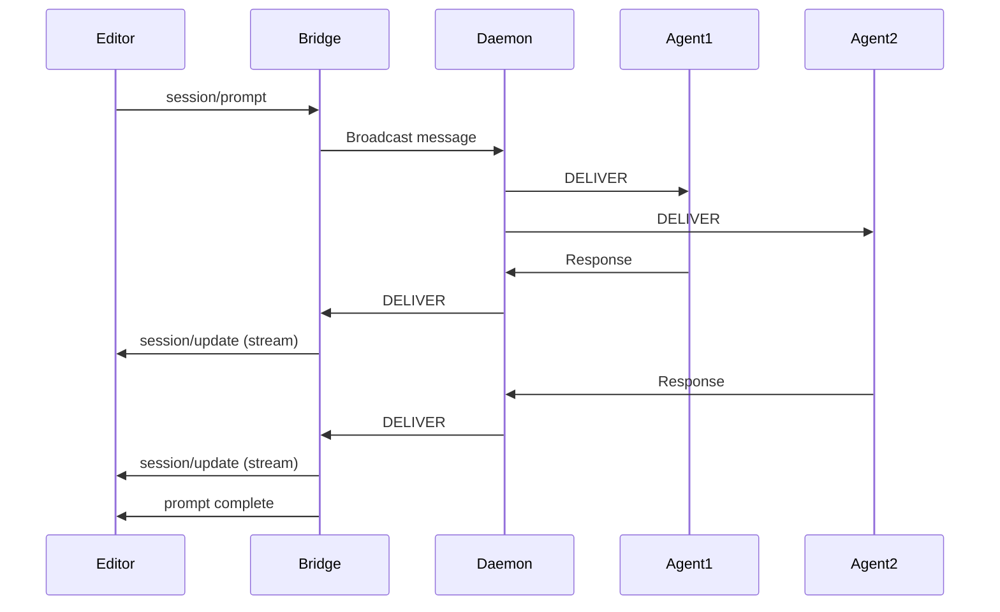

# Editor Integration with ACP

Agent Relay can be integrated with code editors like [Zed](https://zed.dev), [Neovim](https://neovim.io), and other editors that support the [Agent Client Protocol (ACP)](https://agentclientprotocol.com).

## What is ACP?

The **Agent Client Protocol** is an open standard (created by Zed Industries) that enables AI agents to integrate with code editors. Think of it as LSP (Language Server Protocol), but for AI coding agents.

ACP provides:
- Standardized communication between editors and AI agents
- Session management for conversations
- Tool permissions and file operations
- Streaming responses

## Architecture

The ACP bridge connects your editor to all your relay agents:

```
┌─────────────────┐     ACP (stdio)    ┌─────────────────┐
│   Zed Editor    │ ◄────────────────► │  relay-acp      │
│   (or other)    │   JSON-RPC 2.0     │  (bridge)       │
└─────────────────┘                    └────────┬────────┘
                                                │
                                       Relay Protocol
                                                │
                                       ┌────────▼────────┐
                                       │  Relay Daemon   │
                                       └────────┬────────┘
                                                │
                        ┌───────────────────────┼───────────────────────┐
                        │                       │                       │
                   Agent 1                 Agent 2                 Agent N
                   (Claude)                (Codex)                 (any CLI)
```

When you send a prompt from your editor:

1. The editor sends the prompt via ACP to the bridge
2. The bridge broadcasts to all connected relay agents
3. Agents respond through the relay daemon
4. The bridge streams responses back to the editor

## Installation

<CodeGroup>
```bash npm
npm install -g @agent-relay/acp-bridge
```

```bash From source
cd packages/acp-bridge
npm install
npm run build
npm link
```
</CodeGroup>

## Quick Start

### 1. Start the Relay Daemon

First, ensure the relay daemon is running:

```bash
agent-relay up
```

### 2. Spawn Some Agents

Create agents that will respond to editor prompts:

```bash
# Spawn a code review agent
agent-relay spawn Reviewer claude "Review code changes and suggest improvements"

# Spawn an architect agent
agent-relay spawn Architect claude "Help with system design and architecture decisions"
```

### 3. Configure Your Editor

<Tabs>
  <Tab title="Zed">
    Add to your Zed settings (`~/.config/zed/settings.json`):

    ```json
    {
      "agent": {
        "custom_agents": [
          {
            "name": "Agent Relay",
            "command": "relay-acp",
            "args": ["--name", "zed-bridge"]
          }
        ]
      }
    }
    ```

    Then open the Agent Panel with `Cmd+?` (macOS) or `Ctrl+?` (Windows/Linux) and select "Agent Relay".
  </Tab>

  <Tab title="Neovim">
    If using an ACP-compatible Neovim plugin:

    ```lua
    require('acp').setup({
      agents = {
        {
          name = "Agent Relay",
          command = "relay-acp",
          args = { "--name", "nvim-bridge" }
        }
      }
    })
    ```
  </Tab>

  <Tab title="Other Editors">
    For any ACP-compatible editor, configure it to run:

    ```bash
    relay-acp --name my-editor-bridge
    ```

    The bridge communicates via stdio using newline-delimited JSON.
  </Tab>
</Tabs>

### 4. Start Chatting

Open your editor's AI panel and start typing. Your prompts will be broadcast to all connected relay agents, and their responses will stream back to you.

## CLI Options

```bash
relay-acp [OPTIONS]

Options:
  --name <name>     Agent name for relay identification (default: relay-acp)
  --socket <path>   Path to relay daemon socket
  --debug           Enable debug logging to stderr
  --help            Show help message
  --version         Show version
```

### Environment Variables

| Variable | Description |
|----------|-------------|
| `WORKSPACE_ID` | Used to determine default socket path |

## How It Works

### Session Management

Each editor conversation creates a new ACP session. The bridge:

1. Generates a unique session ID
2. Maintains message history for the session
3. Routes responses using the session ID as a thread identifier

### Message Flow



### Response Streaming

Responses are streamed as they arrive from agents. Each response is formatted as:

```
**AgentName**: Response content here
```

This allows you to see which agent provided each response.

## Programmatic Usage

You can also use the bridge programmatically:

```typescript
import { RelayACPAgent } from '@agent-relay/acp-bridge';

const agent = new RelayACPAgent({
  agentName: 'my-custom-bridge',
  socketPath: '/tmp/relay-daemon.sock',
  debug: true,
  capabilities: {
    supportsSessionLoading: false,
  },
});

await agent.start();
```

### Configuration Options

| Option | Type | Default | Description |
|--------|------|---------|-------------|
| `agentName` | string | `'relay-acp'` | Name used when connecting to relay daemon |
| `socketPath` | string | auto | Path to relay daemon socket |
| `debug` | boolean | `false` | Enable debug logging |
| `capabilities` | object | - | ACP capabilities to advertise |

## Supported ACP Features

| Feature | Status | Notes |
|---------|--------|-------|
| Session creation | ✅ | New sessions supported |
| Prompt handling | ✅ | With streaming responses |
| Cancellation | ✅ | Abort in-flight prompts |
| Session loading | ❌ | Not yet supported |
| Tool calls | ❌ | Coming soon |
| File operations | ❌ | Use relay agents directly |

## Troubleshooting

### Bridge not connecting to daemon

Ensure the relay daemon is running:

```bash
agent-relay status
```

If not running, start it:

```bash
agent-relay up
```

### No responses from agents

Check if any agents are connected:

```bash
agent-relay who
```

If no agents are listed, spawn some:

```bash
agent-relay spawn Worker claude "Help with coding tasks"
```

### Debug logging

Enable debug output to see what's happening:

```bash
relay-acp --debug --name test-bridge
```

Debug logs go to stderr to avoid interfering with the ACP protocol on stdout.

## Best Practices

### 1. Use Specialized Agents

Instead of one general agent, spawn specialized agents:

```bash
# Code specialist
agent-relay spawn Coder claude "Write and modify code"

# Review specialist
agent-relay spawn Reviewer claude "Review code quality and security"

# Architecture specialist
agent-relay spawn Architect claude "Design systems and APIs"
```

### 2. Name Your Bridge

Use descriptive names to identify which editor is connected:

```bash
relay-acp --name "vscode-main"
relay-acp --name "zed-frontend"
```

### 3. Monitor with Dashboard

Use the relay dashboard to see all connected editors and agents:

```bash
agent-relay up --dashboard
```

Then open http://localhost:3888 to see the message flow.

## Comparison with Direct Integration

| Aspect | ACP Bridge | Direct PTY |
|--------|------------|------------|
| Multi-agent | ✅ All agents respond | Single agent per session |
| Editor support | ✅ Any ACP editor | CLI only |
| Response format | Streamed via ACP | Raw terminal output |
| Session management | ACP handles it | Manual |
| Setup complexity | Low | Medium |

The ACP bridge is ideal when you want your editor to access multiple relay agents simultaneously.

## Related

- [Messaging](/features/messaging) - How agent-to-agent messaging works
- [Spawning Agents](/features/spawning) - Creating and managing agents
- [Worker Orchestration](/guides/worker-orchestration) - Coordinating multiple agents
